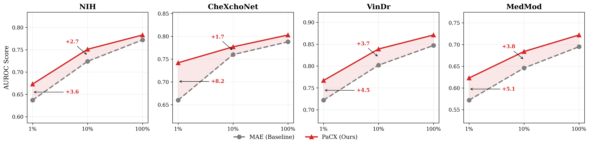
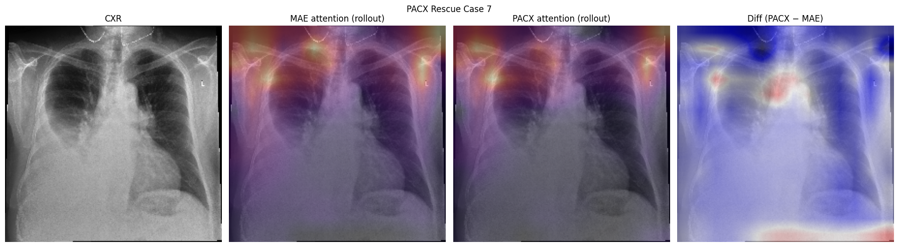

# PaCX-MAE: Physiology-Augmented Chest X-Ray Masked Autoencoder

**Authors:** Yancheng Liu, Kenichi Maeda, Manan Pancholy  
**Institution:** Department of Computer Science, Brown University  
**Corresponding Author:** yancheng_liu@brown.edu

## 🧬 Overview

**PaCX-MAE** is a cross-modal distillation framework that injects physiological priors into chest X-ray (CXR) encoders while remaining strictly unimodal at inference. The model bridges the gap between multimodal training and unimodal deployment, allowing a vision encoder to "hallucinate" physiological context (such as cardiac electrical activity or fluid status) from anatomical data alone.

The framework utilizes:

* **In-domain Masked Autoencoding (MAE)** for robust anatomical representation.
* **Cross-Modal Distillation** to align visual features with physiological signals (ECG and Lab values).
* **Dual Contrastive-Predictive Objective** to enforce both global semantic alignment and dense feature reconstruction.

## 🔍 Key Features

* 🧠 **Physiological Distillation:** Distills dense signals (ECG waveforms, Lab values) into CXR representations.
* 🔄 **Two-Stage Curriculum:** Decouples representation learning (Stage 1: Unimodal MAE) from cross-modal alignment (Stage 2: Distillation) to prevent catastrophic forgetting.
* 🧩 **Parameter-Efficient Adaptation (LoRA):** Uses Low-Rank Adaptation to bridge the modality gap while keeping the core visual manifold stable.
* 🎯 **Dual Objective:** Combines **InfoNCE contrastive loss** for global alignment and **Cosine Distance regression** for reconstructing dense physiological embeddings.
* 📈 **Superior Performance:** Outperforms domain-specific MAE on physiology-heavy benchmarks (e.g., +2.7% AUROC on MedMod, +6.5% F1 on VinDr-CXR).
* 📉 **Label Efficiency:** Achieves robust generalization in low-data regimes (1% training data), significantly surpassing baselines.
* 👁️ **Interpretability:** Attention Rollout confirms the model focuses on relevant physiological indicators, such as the cardiac silhouette.

## 📂 Dataset

**Pretraining Data:**

* **CheXpert:** Used for initializing the vision backbone via Masked Autoencoding (MAE).
* **Symile-MIMIC:** Used for cross-modal distillation, containing ~10k paired triplets of CXR, ECG, and Laboratory data.

**Evaluation Benchmarks:**
PaCX-MAE is evaluated on 9 public benchmarks covering various tasks:

* **Physiology-Dense:** CheXchoNet (Fluid Overload), VinDr-CXR, MedMod.
* **Structural/Segmentation:** CXL-Seg, COVID-QU-Ex.
* **Classification:** TB, ChestX6, NIH-14, QaTa-COV19.

## 🏗️ Architecture

<p align="center">

</p>

The architecture consists of three stages:

1. **Stage 1 (Unimodal Pretraining):** A ViT-B vision backbone is pretrained with Masked Autoencoding (90% masking) to learn anatomical semantics.
2. **Stage 2 (Cross-Modal Distillation):** The CXR encoder is aligned with frozen physiological targets (**ECGFounder** for ECG, **DAE** for Labs) using a dual contrastive-predictive objective and LoRA adapters.
3. **Stage 3 (Inference):** A strictly unimodal execution where the CXR encoder predicts downstream tasks using the internalized physiological priors.

## ⚙️ Training Objective

The distillation stage uses a hybrid loss function:
$$L_{total} = \lambda_C L_{contrastive} + \lambda_R L_{regression}$$

* **Global Contrastive Alignment ($L_C$):** Aligns CXR, ECG, and Lab embeddings in a shared latent space via InfoNCE.
* **Latent Regression ($L_R$):** Forces the visual encoder to predict the exact unprojected embeddings of the frozen physiological encoders, ensuring dense structural transfer.

## 📊 Results

### Clinical Transfer & Data Efficiency

PaCX-MAE consistently outperforms baselines on physiology-dependent tasks while maintaining parity on structural segmentation.

| Dataset | Metric | ImageNet | MAE (Domain) | PaCX-MAE |
| --- | --- | --- | --- | --- |
| **MedMod** | AUROC | 0.612 | 0.695 | **0.722** |
| **VinDr-CXR** | F1 | 0.097 | 0.191 | **0.256** |
| **CheXchoNet** | F1 | 0.147 | 0.215 | **0.266** |
| **TB** | AUROC | 0.887 | 0.899 | **0.910** |
| **CXL-Seg** | IoU | 0.984 | 0.996 | **0.996** |

### Low-Data Regime (1%)

<p align="center">

</p>

In the 1% data regime, PaCX-MAE consistently surpasses the MAE baseline, showing AUROC improvements of ~8% on CheXchoNet and ~4% on VinDr and NIH.

### Interpretability

<p align="center">

</p>

Zero-shot and attention analyses confirm that PaCX-MAE shifts focus from bony structures (common in MAE) to soft-tissue indicators like the cardiac silhouette.

## 📁 Repository Structure

```
/Data
- {dataset_name}_data.ipynb  # Data processing (stats, preprocessing)
- create_datasets.py         # Dataset creation for pretraining/downstream
- data_modules.py            # Lightning data modules
/Models
- mae.py                     # ViT backbone for MAE pretraining
- models.py                  # Downstream task models (Classification/Seg)
- labs_dae.py                # Denoising Autoencoder for Lab values
/Modules
- {stage}_lit.py             # Lightning scripts for MAE, PaCX, Classification, Seg
/Scripts                     # Exploration/processing for CheXchoNet, Symile, MedMod
/Utils                       # Utilities (e.g., param group optimization)
/Env                         # Environment files
/Figs                        # Project figures
Stage1_MAE.py                # CLIs for MAE pretraining
Stage2_PACX.py               # CLIs for PaCX pretraining
Stage3_{task}.py             # CLIs for Alignment, Low-Data, Seg, Classification, Attention Visualization
PaCX-MAE.pdf                 # Final Report for PaCX-MAE
```

## 📌 Requirements

**Option 1: Conda (Recommended)**
You can recreate the exact environment using the provided `environment.yml` file:

```bash
conda env create -f ./Env/environment.yml
conda activate pacx
```

**Option 2: Pip**
Alternatively, install dependencies via `requirements.txt`:

```bash
pip install -r ./Env/requirements.txt
```

## 📬 Contact

For questions or collaboration inquiries, please contact:\
**Yancheng Liu** – yancheng_liu@brown.edu \
**Project Link:** [GitHub Repository](https://github.com/Lyce24/PACX-MAE/)